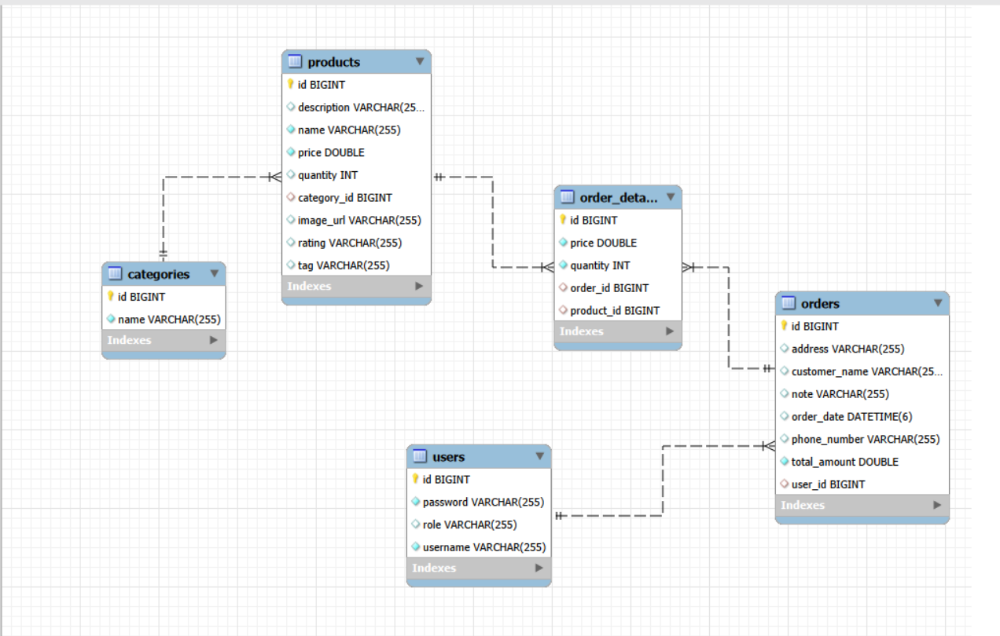

🚀 BÁO CÁO ĐỀ TÀI: HỆ THỐNG QUẢN LÝ BÁN HÀNG (CSMS)
Nhóm thực hiện: Nhóm 17
1. 📌 1. Giới thiệu đề tàiTrong thời đại công nghệ số hiện nay, việc ứng dụng CNTT vào quản lý hoạt động kinh doanh bán hàng là nhu cầu tất yếu giúp tối ưu hóa quy trình, nâng cao trải nghiệm khách hàng và giảm thiểu sai sót vận hành.Đề tài "Hệ thống Quản lý Bán hàng" do Nhóm 17 nghiên cứu và phát triển dựa trên nền tảng Spring Boot Framework kết hợp giao diện Thymeleaf và cơ sở dữ liệu quan hệ MySQL/H2. Hệ thống cung cấp giải pháp bán hàng trực tuyến toàn diện, cho phép phân quyền chặt chẽ giữa Quản trị viên (Admin) và Khách hàng (User), xử lý mượt mà luồng mua sắm khép kín từ khâu duyệt sản phẩm, giỏ hàng, đặt hàng cho đến xuất hóa đơn.
2. 🛠️ 2. Công nghệ sử dụngBackend: Java 17+, Spring Boot 3.x, Spring Data JPA, Spring Security.Frontend: HTML5, CSS3, Thymeleaf Engine, JavaScript (window.print).Database: MySQL / H2 Database.Thư viện phụ trợ: Lombok, Jakarta Validation, BCrypt.
3. ✨ 3. Các tính năng chính của hệ thống👨‍💼 
4. A. Phân hệ Quản trị viên (Admin)Quản lý Sản phẩm (CRUD):Thêm mới, chỉnh sửa thông tin và xóa sản phẩm.Tải ảnh sản phẩm lên trực tiếp từ thiết bị (Upload Image).Ràng buộc dữ liệu đầu vào (Validation): tên không trống, giá & số lượng $> 0$.Phân loại & Lọc sản phẩm: Quản lý sản phẩm gắn liền với các Danh mục (Category) tương ứng.Cảnh báo Tồn kho: Hệ thống tự động theo dõi số lượng tồn kho, đưa ra cảnh báo "Sắp hết hàng" (khi số lượng $\le 5$) hoặc "Hết hàng".Quản lý Đơn hàng & Doanh thu:Xem toàn bộ danh sách đơn hàng của tất cả khách hàng trong hệ thống.Thống kê tổng số lượng đơn hàng và tự động tính Tổng doanh thu.Xem chi tiết từng đơn hàng và xuất/in Hóa đơn bán hàng.👤 
5. B. Phân hệ Khách hàng (User)Xác thực & Phân quyền:Đăng ký tài khoản mới và Đăng nhập bảo mật (mã hóa mật khẩu qua BCrypt).Phân quyền Spring Security (Khách hàng chỉ truy cập được các chức năng mua sắm, không sửa được dữ liệu hệ thống).Duyệt & Tìm kiếm Sản phẩm:Tìm kiếm sản phẩm theo tên.Lọc sản phẩm theo từng Danh mục cụ thể (Điện thoại, Thời trang, Gia dụng...).Tự động khóa nút "Thêm giỏ" khi sản phẩm đã hết hàng trong kho.Giỏ hàng & Thanh toán (Cart & Checkout):Thêm/Sửa/Xóa số lượng sản phẩm trong giỏ hàng.Tự động tính tổng tiền thanh toán theo real-time.Tiến hành đặt hàng: Nhập thông tin giao hàng (Họ tên, SĐT, Địa chỉ, Ghi chú).Tự động trừ số lượng tồn kho tương ứng của sản phẩm sau khi chốt đơn thành công.Lịch sử Đơn hàng & In Hóa đơn:Xem danh sách đơn hàng đã đặt cá nhân (/my-orders).Xem thông tin chi tiết từng đơn hàng.In Hóa đơn / Xuất PDF: Hỗ trợ render giao diện hóa đơn chuẩn in ấn, tích hợp nút in nhanh tiện lợi.
## 📐 Quy chuẩn Code & Kiến trúc Hệ thống (Code Standards & Architecture)

### 1. Quy tắc đặt tên (Naming Conventions)
Dự án tuân thủ nghiêm ngặt quy chuẩn đặt tên tiêu chuẩn của ngôn ngữ Java và Framework Spring Boot:
* **Class / Interface:** Dùng quy tắc `PascalCase` (Viết hoa chữ cái đầu của mỗi từ).
    * *Ví dụ:* `ProductController`, `OrderService`, `CategoryRepository`.
* **Variable / Method / Field:** Dùng quy tắc `camelCase` (Viết thường chữ cái đầu, các từ sau viết hoa chữ cái đầu).
    * *Ví dụ:* `productService`, `totalAmount`, `findOrdersByUsername()`.
* **Hằng số (Constant):** Dùng quy tắc `UPPER_SNAKE_CASE` (Viết hoa toàn bộ, phân cách bằng dấu gạch dưới).
    * *Ví dụ:* `ROLE_ADMIN`, `MAX_PAGE_SIZE`.
* **File View / HTML / Resource:** Dùng quy tắc `kebab-case` (Viết thường, phân cách bằng dấu gạch nối).
    * *Ví dụ:* `my-orders.html`, `admin-orders.html`, `style.css`.

---

### 2. Chuẩn Trình bày & Định dạng Code (Formatting & Clean Code)
* **Comment:**
    * Mỗi Class, Controller, Service Method đều chứa Javadoc (`/** ... */`) hoặc Single-line Comment (`//`) mô tả ngắn gọn mục đích xử lý, tham số đầu vào và kết quả trả về.
* **Indentation (Thụt lùi dòng):**
    * Thụt lùi đúng **4 spaces** cho các khối lệnh Java.
    * Thụt lùi đúng **2 spaces** cho cấu trúc thẻ HTML / Thymeleaf.
* **Spacing (Khoảng cách):**
    * Có 1 khoảng trắng sau các từ khóa điều khiển: `if (...)`, `for (...)`, `try (...)`.
    * Có 1 khoảng trắng xung quanh các toán tử gán, so sánh và logic: `=`, `+`, `-`, `==`, `&&`.
* **Newline (Dòng trống):**
    * Sử dụng dòng trống để phân tách giữa các Field, Constructor và Method.
    * Trong cùng 1 hàm, dòng trống được dùng để phân tách các bước logic chính (Validation → Query DB → Data Binding → Return).

---

### 3. Luồng đi của dữ liệu (Data Flow in MVC)
Hệ thống vận hành theo đúng mô hình kiến trúc **MVC (Model - View - Controller)**:

1. **Client (Browser):** Người dùng gửi **HTTP Request** (GET/POST) chứa tham số (Form Data, Query Params, Path Variables).
2. **Controller:** Lớp Controller nhận Request thông qua `@GetMapping` hoặc `@PostMapping`, tiến hành validate dữ liệu đầu vào và gọi lớp **Service** tương ứng.
3. **Service & Repository:** Service thực hiện logic nghiệp vụ (tính toán tổng tiền, kiểm tra tồn kho, trừ kho...), sau đó gọi **JpaRepository** để thao tác truy vấn xuống **Database**.
4. **Model Binding:** Dữ liệu Entity/DTO nhận về từ Database được Controller đóng gói vào đối tượng **`Model`** thông qua `model.addAttribute("key", value)`.
5. **View Rendering:** Controller trả về chuỗi String chứa tên file Template. Engine **Thymeleaf** tiếp nhận `Model`, đổ dữ liệu vào các thẻ HTML và render thành trang HTML tĩnh gửi trả về cho Browser.

---

### 4. Phương thức cấu hình Hệ thống (Configuration Methods)
Dự án được cấu hình tập trung qua các thành phần:
* **`application.properties`:** Cấu hình cổng server (`server.port`), thông số kết nối Database MySQL/H2 (URL, Username, Password, Driver) và cơ chế tự động cập nhật bảng Hibernate (`spring.jpa.hibernate.ddl-auto=update`).
* **`SecurityConfig.java`:** Cấu hình Spring Security với `@Configuration` & `@EnableWebSecurity`:
    * Phân quyền truy cập các đường dẫn URL (`.requestMatchers()`).
    * Cấu hình luồng Đăng nhập (`.formLogin()`) và Đăng xuất (`.logout()`).
    * Khai báo Bean `PasswordEncoder` dùng mã hóa mật khẩu `BCryptPasswordEncoder`.
* **`DataInitializer.java`:** Triển khai `CommandLineRunner` để tự động khởi tạo dữ liệu mặc định (tài khoản Admin, Danh mục mẫu) khi hệ thống chạy lần đầu.

---

### 5. Định dạng Kết quả trả về (Data Formatting)
Việc định dạng dữ liệu đầu ra được phân chia xử lý rõ ràng giữa Backend và Frontend:
* **Định dạng ở tầng View (Thymeleaf HTML):**
    * **Giá tiền / Số học:** Sử dụng Utility Object `#numbers` để format số nguyên thành chuỗi phân cách hàng nghìn theo chuẩn VNĐ:  
      `th:text="|${#numbers.formatInteger(product.price, 1, 'POINT')} ₫|"` (Chuyển `1000000` thành `1.000.000 ₫`).
    * **Ngày tháng / Thời gian:** Sử dụng Utility Object `#temporals` để format đối tượng `LocalDateTime`:  
      `th:text="${#temporals.format(order.orderDate, 'dd/MM/yyyy HH:mm')}"`.
* **Định dạng ở tầng Backend (Java):**
    * Format chuỗi tên file ảnh tải lên theo mốc thời gian Unix Epoch (`System.currentTimeMillis() + "_" + originalFilename`) nhằm đảm bảo tính duy nhất của tên file trên ổ đĩa.
### 6. Quy chuẩn Lựa chọn Kiểu dữ liệu (Data Types Standard)

| Trường dữ liệu | Kiểu dữ liệu | Lý do kỹ thuật chọn |
| :--- | :--- | :--- |
| **Khóa chính (`id`)** | `Long` | Cho phép nhận `null` khi đối tượng mới khởi tạo và tránh tràn bộ nhớ khi số lượng bản ghi lớn. |
| **Tên, Địa chỉ, SĐT** | `String` | Lưu chuỗi ký tự. SĐT dùng String để giữ nguyên số `0` ở đầu. |
| **Giá tiền, Tổng tiền** | `Double` | Hỗ trợ tính toán tiền tệ và tương thích tốt với Form Validation. |
| **Số lượng kho / Mua** | `Integer` | Quản lý số lượng mặt hàng, kiểm soát cảnh báo tồn kho. |
| **Thời gian tạo đơn** | `LocalDateTime` | Lưu chính xác ngày giờ tạo giao dịch theo chuẩn API Java 8+. |
sơ đồ database :
